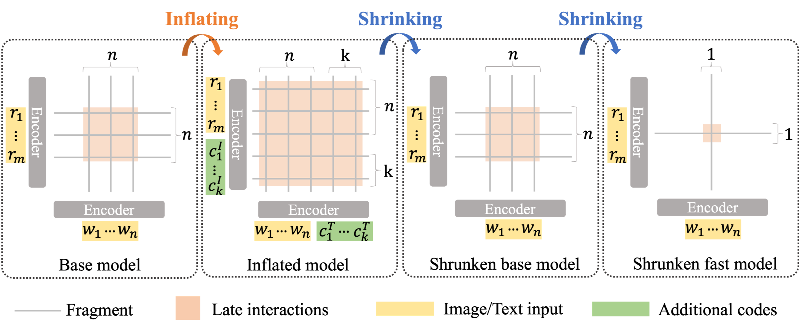

# Inflate and shrink

Code for the submission #81

The code is based on [SCAN](https://github.com/kuanghuei/SCAN).

---

<p align="center">
  
</p>


## Install
> Work with Pytorch 1.4 and python 3.6
```

pip install tensorboard_logger
pip install boto3 
pip install transformers 
pip install nltk 
pip install opencv-python
pip install matplotlib
pip install cloudpickle
pip install pyyaml
pip install easydict

git clone https://github.com/NVIDIA/apex
cd apex
pip install -v --disable-pip-version-check --no-cache-dir --global-option="--cpp_ext" --global-option="--cuda_ext" ./
```


## Download Pretrained Weights

You can download the pretrained bert model provided by HuggingFace through this [link](https://huggingface.co/bert-base-uncased/tree/main).
Then move your downloaded pytorch_model.bin file to the Inflate_shrink/bert folder.

We provide trained weights:

1. [I (Inflate model)](https://drive.google.com/file/d/1SVUGmFpIi57HgTDuZshiEr5ooBPWCnuw/view?usp=sharing)
2. [I -> B (base model)](https://drive.google.com/file/d/1DRunEgnkh-ptHji2bCQvEPe3LI4dF58H/view?usp=sharing)
3. [I -> B -> F (fast model)](https://drive.google.com/file/d/1fJb-E1aRZjzBnss0alp5smb8ADFVj_fA/view?usp=sharing)

## Dataset Preparation
Please kindly refer to [DATA.md](DATA.md)

## Train New Models
Please kindly refer to [TRAIN.md](TRAIN.md)

## Evaluation
Please kindly refer to [EVAL.md](EVAL.md)


